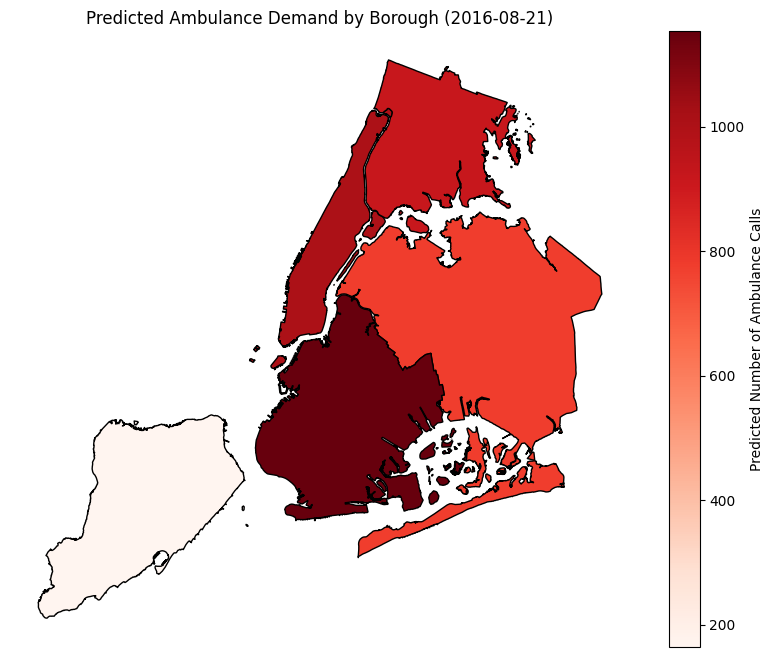

# How Many Ambulances Do We Need? Predicting Ambulance Demand    
## Hook
Given the importance of needing ambulances to address emergency health situations, using algorithms to optimize allocation will help improve public health.    
## Problem Statement 
Often ambulances are dispatched from rescue squad stations, which often leads to late arrivals to the scene, but sometimes are at locations where events are planned or expected in case of need. The problem is that ambulances often have to face traffic and great distances from events to get where they need to get, and if they were able to be strategically placed to predict where they will be most needed, this could improve efficiency.     
## Solution Description     
This solution uses a random forest algorithm to predict the amount of ambulance calls that will occur for a given borough on a certain day based on information from prior incidences. Specifically we analyze demographic information of boroughs, city events, and weather. The algorithm predicts the amount of calls that will happen at a certain borough on that day, which can then help with better allocating resources and agencies being prepared to handle emergencies occurring, to then improve overall health outcomes.      
## Chart 
   
This chart shows a map created using this database and the random forest model, predicting ambulance demand for one specific day. We can see based on past history, weather, events, and borough demographics, there is a different predicted ambulance demand for each borough, which can thus be used to better allocate emergency response resources. 