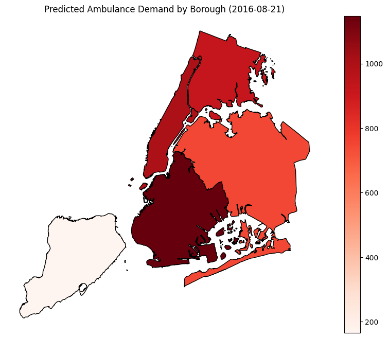

# How many ambulances do we need? Using prediction to optimize ambulance allocation    
## Given the importance of needing ambulances to address emergency health situations, using algorithms to optimize allocation will help improve public health.  
## Often ambulances are dispatched from rescue squad stations, which often leads to late arrivals to the scene, but sometimes are at locations where events are planned or expected in case of need. The problem is that ambulances often have to face traffic and great distances from events to get where they need to get, and if they were able to be strategically placed to predict where they will be most needed, this could improve efficiency. 
## (NNU FIX) This solution proposes using predictive algorithms based on information from prior incidences to better allocate ambulances to prepare for potential events based on time, dates, weather, location, and people. 
## Chart 
