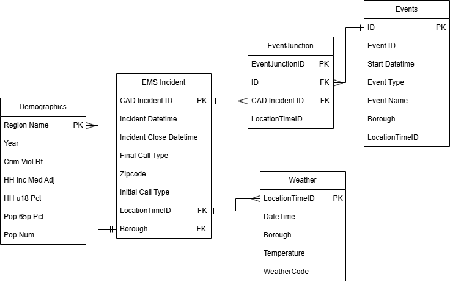

# DS 4320 Project 1: EMS Demand Prediction
This repository contains materials for a project for DS4320 Data by Design on predicting ambulance demand for allocating emergency response resources.    
Name: Nyla Upal      
NetID: mge9dn     
DOI:       
Press Release: [Press Release File](https://github.com/nylaup/ds4320-project1/blob/main/PressRelease.md)     
Data: [Data Folder](https://myuva-my.sharepoint.com/:f:/g/personal/mge9dn_virginia_edu/IgC6wpB5VoZrSaNl7BUKjM_7AXOBHNlLw-Pnpqv3Uem2Bsg?e=o4zhK4)     
Pipeline: [Solution Pipeline](https://github.com/nylaup/ds4320-project1/tree/main/pipeline)     
License: [MIT License](https://github.com/nylaup/ds4320-project1/blob/main/LICENSE)    

## Problem Definition
The initial general problem is allocating emergency response resources. The specific problem is predicting the number of ambulance calls that will happen at a specific date and location, based on temperature, weather, planned events, and demographic information of that neighborhood in order to better allocate emergency response resources and better address potential emergencies and minimize expected response times.         
The rationale for this refinement is that based on the general problem of emergency response resources, I decided to refine it to a specific resource of ambulances. Hearing from people who have worked as EMTs, I have heard an important part of working in an ambulance is being able to navigate to where they are needed and getting there promptly enough. Using a predictive algorithm would help to be able to figure out where to best allocate the emergency resouces to predict where they will be needed based on historical incidences.      
The motivation for this project is that oftentimes emergencies are unpredictable and but in other cases one can look at historical incidences and future conditions to predict something may occur and be better prepared. When many events are happening often ambulances are stationed nearby, in order to be best prepared in case an emergency event does happen and they can arrive quickly. Looking at prior emergency incidents (location, demographics, weather), response times, and station location, one can best predict where emergency vehicles before emergency events to be better prepared and thus better help people.    

[How Many Ambulances Do We Need? Using prediction to optimize ambulance allocation](https://github.com/nylaup/ds4320-project1/blob/main/PressRelease.md)    
     
## Domain Exposition
| Terms | Definition |     
| :--- | :--- |      
| Demand Forecasting | Using historical data to predict future demand |     
| R^2^ | A measure representing the proportion of the output explained by the model |
| MSE | Mean Squared Error measuring difference between predicted and actual values |
| Allocation Plans | A proposal for distributing resources that are limited |
| MPDS | Medical Priority Dispatch System is the standard used in emergency dispatch prioritization |    
| Weather Code | Used by Open Meteo API to encode weather type |
| Random Forest | Machine Learning Model that uses many decision trees to create an output |
| Cross Validation | Used to assess Machine Learning models performance on new data and improve fit |
| Dispatch | Systematic process of getting emergency calls and assigning medical resources |             
          
             

This project is in the domain of public health, but also intersects with emergency medical services and data driven decision making. Public health aims to improve and protect the health of populations, often focusing on interventions to prevent mortality and improve health, often in high risk situations. By predicting ambulance demand, officials can optimize ambulance placement and response times. This project aims to reduce preventable harm and complications by working for better access to emergency medical care. EMS systems are an important aspect of public health infrastructure, as delayed time can greatly affect outcomes for patients for many urgent conditions. Typically ambulance allocation relies on station location, which may not account for dynamic factors that are very relevant. This project uses machine learning to predict ambulance demand based on historical data, enhancing public health missions of improving population level health outcomes, working with broader health systems, and using data for resource allocation. 

[Folder Link](https://myuva-my.sharepoint.com/:f:/g/personal/mge9dn_virginia_edu/IgBR0XDIMDE1TrWNRUBq7I4UAcOu-jENQX8kEeeLJKZut1k)  

| Title | Description | Link |
| :--- | :--- | :--- |
| Artificial intelligence for modeling and   understanding extreme weather and   climate events | Research on using AI to identify severe   weather events to predict locations   needing ambulances | [Link](https://myuva-my.sharepoint.com/:b:/r/personal/mge9dn_virginia_edu/Documents/Design/BackgroundReadings/s41467-025-56573-8.pdf?csf=1&web=1&e=8pYrey)
| On the optimization of heterogeneous   ambulance fleet allocations | Proposing an algorithm for optimal   allocation of of response vehicle types   to improve patient outcomes | [Link](https://myuva-my.sharepoint.com/:b:/r/personal/mge9dn_virginia_edu/Documents/Design/BackgroundReadings/dpaf027.pdf?csf=1&web=1&e=9NnyNr) |
| Ambulance route optimization in a   mobile ambulance dispatch system   using deep neural network | Creating a neural network model to   improve ambulance routes on traffic   and road data | [Link](https://myuva-my.sharepoint.com/:b:/r/personal/mge9dn_virginia_edu/Documents/Design/BackgroundReadings/41598_2025_Article_95048.pdf?csf=1&web=1&e=cvrtcx) |
| Simulation modeling and optimization   for ambulance allocation considering   spatiotemporal stochastic demand | Proposing a method that uses   simulations to optimize ambulance   allocation and EMS system processes | [Link](https://myuva-my.sharepoint.com/:b:/r/personal/mge9dn_virginia_edu/Documents/Design/BackgroundReadings/1-s2.0-S2096232020300044-main.pdf?csf=1&web=1&e=V2rI67) |
| Where will the next emergency event   occur? Predicting ambulance demand   in emergency medical services using   artificial intelligence | Modeling emergency events and   developing a neural network that   predicts future demand and use a   model to allocate ambulances | [Link](https://myuva-my.sharepoint.com/:b:/r/personal/mge9dn_virginia_edu/Documents/Design/BackgroundReadings/1-s2.0-S0198971519300146-main.pdf?csf=1&web=1&e=04irNi) |
       
## Data Creation 
In order to access all the data to create four tables, I used three files to pull data from separate APIs and one CSV. The EMT incidents dataset is pulled from the NYC Open Data API which is provided by the Fire Department of New York City as it gets generated by the EMS Dispatch System. The NYC Event Information was also from NYC Open Data, sourced from event applications sent to the city government. Both of these needed to be queried with an API key with NYC Open Data, but the data is free and public. Since these were both pulling large amounts of data, to avoid hitting API and memory limits, I queried from the API in batches and then added to the data CSVs in chunks. For the weather I used the Open Meteo API, which uses weather models from various weather services and is free to use and open source. For these tables, I also added a column for LocationTimeID since this was needed to join the tables. I also standardized borough names in all capitals, since that is how they were formatted in the incidents table, and made sure dates and times were in datetime format. For the demographic data by borough, I used a dataset created by the NYU Furman Center on indicators for each neighborhood that got converted from an xlsx to csv. The data dictionary explains how this data is sourced from various public datasets, such as the US Census and ACS.       
| File | Description | Link |
| :--- | :--- | :--- |
| EMS Incident | Data from EMS Dispatch incidents, providing  information on resource assignment, location,   and time on scene  | https://github.com/nylaup/ds4320-project1/blob/main/load/getincidents.py |  
| Demographics | Neighborhood indicators for boroughs of New   York City from various demographic sources | https://github.com/nylaup/ds4320-project1/blob/main/load/demographics.py |
| Weather | API sourced information on weather highs, lows,   and severe weather for each location incident  and time | https://github.com/nylaup/ds4320-project1/blob/main/load/weather.py |
| NYC Events | Events happening in New York City with details  on location and time | https://github.com/nylaup/ds4320-project1/blob/main/load/events.py |           
           
               
Identifying potential biases in this dataset, demographic data by borough was difficult to find, and the csv I found had information from various years, but as I assumed these demographics would not change drastically from year to year I didn't think it would significantly add to the model to have to get separate demographics for each year. It is possible that this could introduce some bias to the model to have outdated information.  These demographics are also borough wide, which may not give the best depiction of individual variation in the neighborhood and assumptions have to be made on these aggregations. With the EMT calls data, EMT calls may not encapsulate all emergencies and are only a very specific sample of people who call emergency services. The weather information only looks at one coordinate in the borough and generalizes for the whole hour. The events dataset is based on events that were registered, which ignores unexpected events that may cause emergencies. For the events, in order to best link them with the incidents, I had the connection on the start time, which may not be the most applicable as events are often ongoing, which may lead to some bias as it only looks at the hour of the event start time and not its full occurence.       
In order to mitigate the bias with demographics, interpretation of the results should acknowledge potential outdated information. When making claims at the borough level, one should be aware this is a large generalization. Making claims from the EMS calls should be limited to just EMS calls and not generalized for all emergencies. Be aware there may be some error with weather not being entirely accurate to the exact location and time of incident, and that there may be some unregistered events the dataset does not cover. In order to mitigate the bias with the event times, the final analysis looks at a daily aggregation, which should avoid the issues of the exact hour of an event starting not reflecting the duration throughout the day, as it counts for the whole day.              
In order to solve the problem of predicting EMS calls, I had to do some judgement calls of what factors I thought might be important and would influence the model. I decided to look at demographics, weather, and events as these were all publicly accessible and made sense based on the background readings and what would affect the amount of EMS calls happening. In order to get a proper scope of the data, I decided to select six years to analyze. I didn't want to use recent data, as it may not yet be available for some sources and I did not want inconsistencies. I also chose to avoid years that would be affected by the COVID-19 pandemic, as those caused irregularities in health systems. For these reasons I chose to query data from 2013 to 2019, which was enough data that it was feasible to load and process, and it also gave a sufficient amount of data for the model to learn from. When selecting the variables, I also had to use some judgement in variables that I thought would be significant or impactful, or at least would want to input into the model to see how impactful they would be to the prediction. For borough demographics, I decided to go with features on income, age, and crimes, as these are features that could be related to various things that cause emergencies. For events, as I was adding the data to tables I noticed there was repetitive event IDs, so I dropped duplicates based on events with the same name that had the same location and time. I also had to then create my own id to use as a primary key, since that was needed for the relational database but the existing eventID was not sufficient.                   

## Metadata  
   
#### Data Tables 
| Table | Description | Link |
| :--- | :--- | :--- |
| EMS Incidents | EMS calls with information on location | [Link](https://myuva-my.sharepoint.com/:x:/g/personal/mge9dn_virginia_edu/IQAirnXwRWwkRIkWfkG0YFUvAftYeMGxV9PJ2bdFV5vNseo?e=2x13Ra) |
| Weather | Weather information for boroughs by hour | [Link](https://myuva-my.sharepoint.com/:x:/g/personal/mge9dn_virginia_edu/IQA7lOVCVxrXQI8oYyXU649VAVisohjtgI4tX0nSuGoaFZI?e=hPcQGD) |
| NYC Events | Information on scheduled events in NYC | [Link](https://myuva-my.sharepoint.com/:x:/g/personal/mge9dn_virginia_edu/IQDBY9zTfkcKSZGTsNcD2ylpAblaR7XEBOtG532vDyMhekI?e=ingvir) |
| Demographics | Demographic information for NYC boroughs | [Link](https://myuva-my.sharepoint.com/:x:/g/personal/mge9dn_virginia_edu/IQC7BjM6bYW3RIHZNlKivXujAZkvVzevmE_MwiUmYsQWpvk?e=e68pvA) |      
        
EMS Incidents Data
| Name | Data Type | Description | Example |      
| :--- | :--- | :--- | :--- |
| CAD_Incident_ID | Num | Unique indentifier for each incident | 160010002 |
| Incident_DateTime | DateTime | Date and time of initial call, rounded to hour | 01/01/2016 12:00:00 |
| Incident_Close_DateTime | DateTime | Date and time of call ending | 01/01/2016 12:50:37 |
| Borough | Cat | New York City borough of incident | BRONX |
| Initial_Call_Type | Cat | Type of emergency call it was first classified by dispatch when the call was received | SICK |
| Final_Call_Type | Cat | Type of emergency call after responders evaluated the scene | INJURY |
| Zipcode | Num | New York City borough of incident | 11201 |
| LocationTimeID | Cat | Key used for junction table and joining, with location, date, hour of incident | BROOKLYN_2016-01-01 00:00:00 |

Events Data
| Name | Data Type | Description | Example |      
| :--- | :--- | :--- | :--- |
| EventID | Num | Unique identifier for each event | 808651 |
| Start_Date_Time | DateTime | Date and time of event start, rounded to hour | 07/26/2025 08:00:00 |
| Event_Type | Cat | Categorization of event type | Special Event |
| Event_Borough | Cat | NYC borough of event | QUEENS |
| Event_Name | Cat | Name the event was registered as | Rehab of Lawn |
| LocationTimeID | Cat | Key used for junction table and joining. Location, date, and hour of incident | MANHATTAN_2016-01-01 00:00:00 |

Demographics
| Name | Data Type | Description | Example |      
| :--- | :--- | :--- | :--- |
| Region_Name | Cat | NYC borough of neighborhood | BROOKLYN |
| Year | Num | Year of demographic | 2016 |
| Crime_Viol_Rt | Num | Rate of serious violent crimes | 5.3 |
| HH_Inc_Med_Adj | Num | Total income of all members of household of median household | 53780 |
| HH_U18_Pct | Num | Percent of households with children under 18 | 32.3 |
| Pop_65p_Pct | Num | Percent of population above 65 | 12.1 |
| Pop_Num | Num | Number of adults and children living in the region | 7956113 |

Weather
| Name | Data Type | Description | Example |      
| :--- | :--- | :--- | :--- |
| DateTime | DateTime | Date and time for weather  observation | 2025-01-01 02:00:00 |
| Borough | Cat | Location for weather observations | MANHATTAN |
| Temperature | Num | Temperature for given time in  Fahrenheit | 47.6 |
| WeatherCode | Num | Codes for severe weather event | 2 | 
| LocationTimeID | Cat | Location, date, and time of weather, used to join with incidents | QUEENS_2017-03-29 01:00:00 |        
            
Quantifying uncertainty for the incidents table, there is no uncertainty in the numeric id or the zip code. Since we rounded the start datetime to the nearest hour, for all of these there is +- 59 minutes. Given that the call times are recorded to the very second, is possible that there is a slight uncertainty in the recording time of +- 1 second. For the close time, I would say this has slightly more uncertainty as it may take some time to report the incident as being closed, or even though the event is reported closed there could still be ongoing issues, so I would report this as +- 5 minutes. For the events, the id is generated to be unique for each event so there is no uncertainty in this. Since we rounded the event start times to the nearest hour, there is +-59 minutes uncertainty. For the weather, since we are generalizing to the hour and one coordinate for each borough, there is some uncertainty on the exact weather for the incident's specific location and time, as well as some potential for error with weather readings, so for temperature there is an uncertainty of +-1 to 3 degrees. The weather code values are very specific to the different weather incident, so there is no uncertainty. For the demographic information, there is the potential for inaccuracies with census data collection for most of the variables. Based on the distribution, I would guess the violent crime rate has an uncertainty of +-0.5, household mean income +-100, percent under 18 +-1, percent above 65 +-0.5, and population +-1000.    
