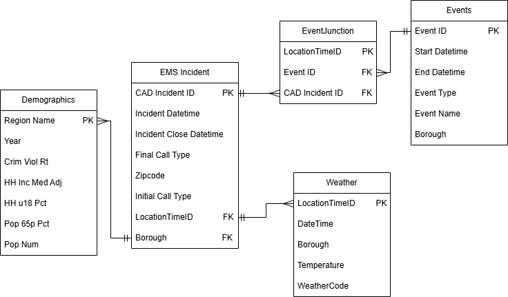

# DS 4320 Project 1: EMS Demand Prediction
This repository contains materials for a project for DS4320 Data by Design on predicting and allocating emergency response resources.    
Name: Nyla Upal      
NetID: mge9dn     
Press Release: [Press Release File](https://github.com/nylaup/ds4320-project1/blob/main/PressRelease.md)     
Data: [Data Folder](https://myuva-my.sharepoint.com/:f:/g/personal/mge9dn_virginia_edu/IgC6wpB5VoZrSaNl7BUKjM_7AXOBHNlLw-Pnpqv3Uem2Bsg?e=o4zhK4)     
Pipeline: [Solution Pipeline](https://github.com/nylaup/ds4320-project1/blob/main/SolutionPipeline.ipynb)     
License: [MIT License](https://github.com/nylaup/ds4320-project1/blob/main/LICENSE)    

## Problem Definition
The initial general problem is allocating emergency response resources. The specific problem is predicting the optimal positioning for ambulances to address potential emergencies and minimize expected response times.     
The rationale for this refinement is that based on the general problem of emergency response resources, I decided to refine it to a specific resource of ambulances. Hearing from people who have worked as EMTs, I have heard an important part of working in an ambulance is being able to navigate to where they are needed and getting there promptly enough. Using a predictive algorithm would help to be able to figure out where to best allocate the emergency resouces to predict where they will be needed based on historical incidences.      
The motivation for this project is that oftentimes emergencies are unpredictable and emergency response resources but in other cases one can look at historical incidences and future conditions to predict something may occur and be better prepared. When large events are happening often ambulances are stationed nearby, in order to be best prepared in case an emergency event does happen and they can arrive quickly. Looking at prior emergency incidents (location, people, weather), response times, and station location, one can best predict where to station emergency vehicles before emergency events.     

[How Many Ambulances Do We Need? Using prediction to optimize ambulance allocation](https://github.com/nylaup/ds4320-project1/blob/main/PressRelease.md)    
     
## Domain Exposition
| Terms | Definition |     
| :--- | :--- |      
| Demand Forecasting | Using historical data to predict future demand |     
| Response time | The duration between a call and the emergency vehicle arrival |
| MSE | Mean Squared Error measuring difference between predicted   and actual values |
| Allocation Plans | A proposal for distributing resources that are limited |
| MPDS | Medical Priority Dispatch System is the standard used in   emergency dispatch prioritization |  
| Time Series | Modeling tool that looks at data collected over time |
| Dispatch | Systematic process of getting emergency calls and assigning   medical resources |              
          
             
(NNU: FIX) The project is in the domain of public health, since it is focusing on population wellbeing. Public health works to improve community health and often intersects with data science to improve access to care. Focusing on improving ambulance responses will improve patient survival rates and improve access to care.      

[Folder Link](https://myuva-my.sharepoint.com/:f:/g/personal/mge9dn_virginia_edu/IgBR0XDIMDE1TrWNRUBq7I4UAcOu-jENQX8kEeeLJKZut1k)  

| Title | Description | Link |
| :--- | :--- | :--- |
| Artificial intelligence for modeling and   understanding extreme weather and   climate events | Research on using AI to identify severe   weather events to predict locations   needing ambulances | [Link](https://myuva-my.sharepoint.com/:b:/r/personal/mge9dn_virginia_edu/Documents/Design/BackgroundReadings/s41467-025-56573-8.pdf?csf=1&web=1&e=8pYrey)
| On the optimization of heterogeneous   ambulance fleet allocations | Proposing an algorithm for optimal   allocation of of response vehicle types   to improve patient outcomes | [Link](https://myuva-my.sharepoint.com/:b:/r/personal/mge9dn_virginia_edu/Documents/Design/BackgroundReadings/dpaf027.pdf?csf=1&web=1&e=9NnyNr) |
| Ambulance route optimization in a   mobile ambulance dispatch system   using deep neural network | Creating a neural network model to   improve ambulance routes on traffic   and road data | [Link](https://myuva-my.sharepoint.com/:b:/r/personal/mge9dn_virginia_edu/Documents/Design/BackgroundReadings/41598_2025_Article_95048.pdf?csf=1&web=1&e=cvrtcx) |
| Simulation modeling and optimization   for ambulance allocation considering   spatiotemporal stochastic demand | Proposing a method that uses   simulations to optimize ambulance   allocation and EMS system processes | [Link](https://myuva-my.sharepoint.com/:b:/r/personal/mge9dn_virginia_edu/Documents/Design/BackgroundReadings/1-s2.0-S2096232020300044-main.pdf?csf=1&web=1&e=V2rI67) |
| Where will the next emergency event   occur? Predicting ambulance demand   in emergency medical services using   artificial intelligence | Modeling emergency events and   developing a neural network that   predicts future demand and use a   model to allocate ambulances | [Link](https://myuva-my.sharepoint.com/:b:/r/personal/mge9dn_virginia_edu/Documents/Design/BackgroundReadings/1-s2.0-S0198971519300146-main.pdf?csf=1&web=1&e=04irNi) |
       
## Data Creation 
In order to access all the data to create four tables, I used three csvs and an API. The EMT Incidents data is a dataset downloaded from NYC Open Data which is provided by the Fire Department of New York City as it gets generated by the EMS Dispatch System. The NYC Event Information was also from NYC Open Data, sourced from event applications sent to the city government. Both of these needed to be queried with an API key with NYC Open Data, but the data is free and public. For the weather I used the Open Meteo API, which uses weather models from various weather services and is free to use and open source. For the demographic data by borough, I used a dataset created by the NYU Furman Center on indicators for each neighborhood that got converted from an xlsx to csv. The data dictionary explains how this data is sourced from various public datasets, such as the US Census and ACS.     
| File | Description | Link |
| :--- | :--- | :--- |
| EMS Incident | Data from EMS Dispatch incidents, providing  information on resource assignment, location,   and time on scene  | https://github.com/nylaup/ds4320-project1/blob/main/load/getincidents.py |  
| Demographics | Neighborhood indicators for boroughs of New   York City from various demographic sources | https://github.com/nylaup/ds4320-project1/blob/main/load/demographics.py |
| Weather | API sourced information on weather highs, lows,   and severe weather for each location incident  and time | https://github.com/nylaup/ds4320-project1/blob/main/load/weather.py |
| NYC Events | Events happening in New York City with details  on location and time | https://github.com/nylaup/ds4320-project1/blob/main/load/events.py |           
           
               
Identifying potential biases in this dataset, demographic data by borough was difficult to find, and the csv had information from various years, so this could introduce some bias through having outdated information, or having information from different years for different boroughs. These demographics are also neighborhood wide, which may not give the best depiction of individual variation in the neighborhood and assumptions have to be made on these aggregations. With the EMT calls data, EMT calls may not encapsulate all emergencies and are only a very specific sample of people who call emergency services. The weather information only looks at one coordinate in the borough and generalizes for the whole hour. The events dataset is based on events that were registered, which ignores unexpected events that may cause emergencies.      
In order to mitigate the bias, you can identify which year for each datapoint so you can account for differences in years, and interpretation of the results should acknowledge these inconsistencies. When making claims at the borough level, one should be aware this is a large generalization. Making claims from the EMS calls should be limited to just EMS calls and not generalized for all emergencies. Be aware there may be some error with weather not being entirely accurate to the exact location and time of incident, and that there may be some unregistered events the dataset does not cover.          
(NNU FIX) In order to solve the problem of predicting EMS calls, I had to do some judgement calls of what factors I thought might be important and would influence the model. I decided to look at demographics, weather, and events as these were all publicly accessible and made sense. Given the datasets, I also decided to only look at one year, and to focus on 2025 as that would give recent and applicable information. As there were too many calls in the timeframe of one year, I decided to shorten this to just three months, from January to March, to make this dataset creation feasible.     

## Metadata  
   
#### Data Tables 
| Table | Description | Link |
| :--- | :--- | :--- |
| EMS Incidents | EMS calls with information on location | [Link](https://myuva-my.sharepoint.com/:x:/g/personal/mge9dn_virginia_edu/IQChxf14yfHKT7SwUXKo-eT5AYEeQsjkUh7NJflaTGMejoA) |
| Weather | Weather information for boroughs by hour | [Link](https://myuva-my.sharepoint.com/:x:/g/personal/mge9dn_virginia_edu/IQB3PpuKpOBQSZ6zxpsz1YXcARF89PyEFdxU8Wqq_uHyHoQ?e=HURIKe) |
| NYC Events | Information on scheduled events in NYC | [Link](https://myuva-my.sharepoint.com/:x:/g/personal/mge9dn_virginia_edu/IQBYiUPJ5sqmSpBV8QQ1AvutAe_Io1xZUSp_Kf7UfwejNM4?e=Iaty4H) |
| Demographics | Demographic information for NYC boroughs | [Link](https://myuva-my.sharepoint.com/:x:/g/personal/mge9dn_virginia_edu/IQATGgL_qTU9RbNhMWB0nVCBAeRv70jNtv0gm9ab_0BkDxs?e=9EITpA) |      
        
EMS Incidents Data
| Name | Data Type | Description | Example |      
| :--- | :--- | :--- | :--- |
| CAD_Incident_ID | Num | Unique indentifier for each incident | 160010002 |
| Incident_DateTime | DateTime | Date and time of initial call | 01/01/2016 12:00:37 |
| Incident_Close_DateTime | DateTime | Date and time of call ending | 01/01/2016 12:50:37 |
| Borough | Cat | New York City borough of incident | BRONX |
| Initial_Call_Type | Cat | Type of emergency call it was first classified by dispatch when the call was received | SICK |
| Final_Call_Type | Cat | Type of emergency call after responders evaluated the scene | INJURY |
| Zipcode | Num | New York City borough of incident | 11201 |
| LocationTimeID | Cat | Key used for junction table and joining, with location, date, date time of incident | BROOKLYN_2016-01-01 00:00:17 |

Events Data
| Name | Data Type | Description | Example |      
| :--- | :--- | :--- | :--- |
| EventID | Num | Unique identifier for each event | 808651 |
| Start_Date_Time | DateTime | Date and time of event start | 07/26/2025 08:00:00 AM |
| End_Date_Time | DateTime | Date and time of event end | 10/10/2025 11:59:00 PM |
| Event_Type | Cat | Categorization of event type | Special Event |
| Event_Borough | Cat | NYC borough of event | QUEENS |
| Event_Name | Cat | Name the event was registered as | Rehab of Lawn |
| LocationTimeID | Cat | Key used for junction table and joining. Location, date, and time of incident | MANHATTAN_2016-01-01 00:00:00 |

Demographics
| Name | Data Type | Description | Example |      
| :--- | :--- | :--- | :--- |
| Region_Name | Cat | NYC borough of neighborhood | BROOKLYN |
| Year | Num | Year of demographic | 2016 |
| Crime_Viol_Rt | Num | Rate of serious violent crimes | 5.3 |
| HH_Inc_Med_Adj | Num | Total income of all members of household of median household | 53780 |
| HH_U18_Pct | Num | Percent of households with children under 18 | 32.3 |
| Pop_65p_Pct | Num | Percent of population above 65 | 12.1 |
| Pop_Num | Num | Number of adults and children living in the region | 7956113 |

Weather
| Name | Data Type | Description | Example |      
| :--- | :--- | :--- | :--- |
| DateTime | DateTime | Date and time for weather  observation | 2025-01-01 02:00:00 |
| Borough | Cat | Location for weather observations | MANHATTAN |
| Temperature | Num | Temperature for given time in  Fahrenheit | 47.6 |
| WeatherCode | Num | Codes for severe weather event | 2 | 
| LocationTimeID | Cat | Location, date, and time of weather, used to join with incidents | QUEENS_2017-03-29 01:00:00 |        
            
(NNU FIX) Quantifying uncertainty for the incidents table, there is no uncertainty in the numeric id, and the datetime is autogenerated by the computerized system receiving calls, so the only chance for error there is in the machine reading times. For the events there is no uncertainty with the requesting of events and the ID given to them there. For the weather, since we are generalizing to the hour and one coordinate for each borough, there is some uncertainty on the exact weather for the incident's specific location and time, as well as some potential for error with weather readings, so for temperature there is an uncertainty of +-1 to 3 degrees. For the demographic information, there is the potential for inaccuracies with census data collection for most of the variables.  
